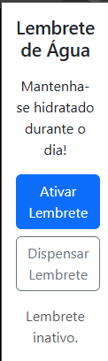

## Lembrete Rápido
acesse pelo gh pages:https://luissguilherme.github.io/BootCamp2-ext/


Uma extensão simples para Google Chrome que lembra o usuário de tomar água a cada 2 horas




## Funcionalidades

- Adicione um Lembrete para beber Água.
- A cada 2 horas, aparecerá uma notificação no seu desktop avisando que está na hora de se hidratar!
- Dispense o lembrete caso não queria mais ser notificado.


## Instalação

1. Abra o Chrome e acesse `chrome://extensions/`.
2. Clone o repositório.
3. Ative o **Modo de desenvolvedor**.
4. Clique em **Carregar sem compactação** e selecione a pasta deste projeto.
5. A extensão surgirá na barra de ferramentas do Chrome.

## Instruções de uso

1. Abra a extensão no Chrome
2. Clique em **Ativar Lembrete** para iniciar o timer, após 2 horas, surgirá a notificação avisando o usuário.
3. Caso queira dispensar o lembrete, apenas clique em **Dispensar Lembrete**


## Estrutura do Projeto

```

│BootCamp2-ext/
│
├── _config.yml
├──  index.md
├──  manifest.json
│
├──  images/
│   ├──  icon16.png
│   ├──  icon32.png
│   ├──  icon48.png
│   ├──  icon128.png
│   ├──  Lembrete.png
│   ├──  Notificacao.png
│   └── screenshot.png (Opcional: para o site)
│
└──  src/
│    ├──  popup.html
│    ├──  popup.js
│    ├──  service-worker.js
│    └── 📄 style.css
│
└──  css/
      ├──  style.css
```

## Permissões

- **notifications**: Para aparecer a notificação na barra de tarefas.
- **alarms**: Para executar a verificação em segundo plano.

## Pages

O projeto possui uma versão no [GitHub Pages](src/index.md).  
Para visualizar, acesse a aba Pages.