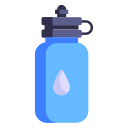
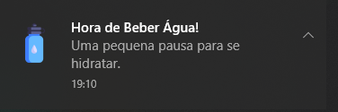

  

# Lembrete para Beber Água

Uma extensão simples para o Google Chrome que ajuda você a se manter hidratado ao longo do dia.

  <a href="https://github.com/LuissGuilherme/BootCamp2-ext/archive/refs/heads/main.zip" class="btn">Baixar Extensão (.zip)</a>

---

## 🤔 Como Funciona?

Manter-se hidratado é essencial para a saúde e produtividade. No entanto, na correria do dia a dia, muitas vezes nos esquecemos de beber água regularmente.

A extensão **Lembrete para Beber Água** resolve esse problema de forma muito simples:

-   💧 **Ativação Fácil:** Com apenas um clique no ícone da extensão, você pode ativar os lembretes.
-   🔔 **Notificações Inteligentes:** A cada 2 horas, a extensão envia uma notificação discreta no seu desktop, lembrando que é hora de se hidratar.
-   🚫 **Controle Total:** Não quer mais receber os lembretes? Basta clicar em "Dispensar" no popup da extensão.

  

---

## 🚀 Como Instalar

A instalação é feita em 3 passos simples, pois a extensão ainda não está na Chrome Web Store.

### 1. Baixe o Código-Fonte
Clique no botão **"Baixar Extensão (.zip)"** no topo desta página e descompacte o arquivo em uma pasta permanente no seu computador.

### 2. Abra a Página de Extensões
No Google Chrome, digite `chrome://extensions` na barra de endereço e pressione **Enter**.

### 3. Carregue a Extensão
-   No canto superior direito, ative o **"Modo de desenvolvedor"**.
-   Clique no botão **"Carregar sem compactação"**.
-   Selecione a pasta que você descompactou no primeiro passo.

**Pronto!** O ícone da extensão aparecerá na sua barra de ferramentas, pronto para ser usado.